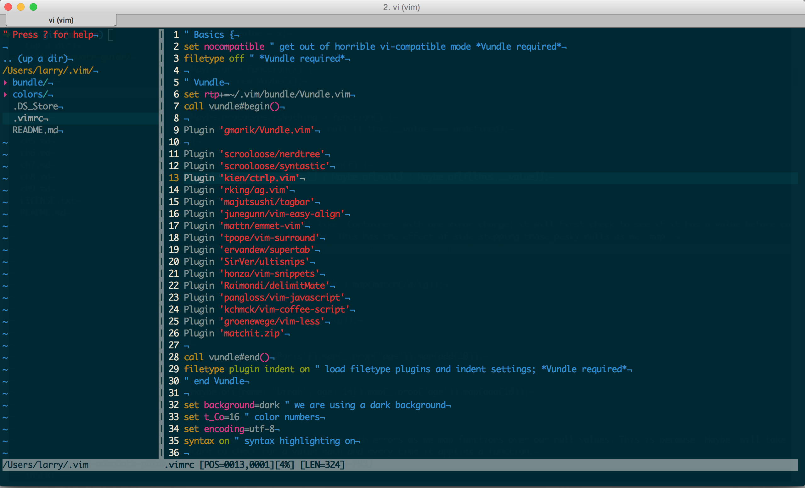

# 效果图



# 插件

1. 插件管理: [Vundle](https://github.com/gmarik/Vundle.vim)
1. 显示目录树: [NERD_tree](https://github.com/scrooloose/nerdtree)
1. 递归查找文件, 类似 Sublime Text 的 `ctrl+p`: [ctrlp](https://github.com/kien/ctrlp.vim)
1. 更快的 `grep`(需要安装 `ag`): [ag.vim](https://github.com/mattn/emmet-vim)
1. 显示当前文件的变量, 函数和类(需要安装 `ctags`): [tagbar](https://github.com/majutsushi/tagbar)
1. 批量对齐: [easyalign](https://github.com/junegunn/vim-easy-align)
1. html自动补全: [emmet](https://github.com/mattn/emmet-vim)

# 安装

### 1.安装 `Vundle.vim`
```bash
git clone https://github.com/llh911001/vimrc
cd vimrc
git submodule update --init
```

### 2. 安装其他插件
在 `vim`(>=7.4) 中执行 `:PluginInstall`
